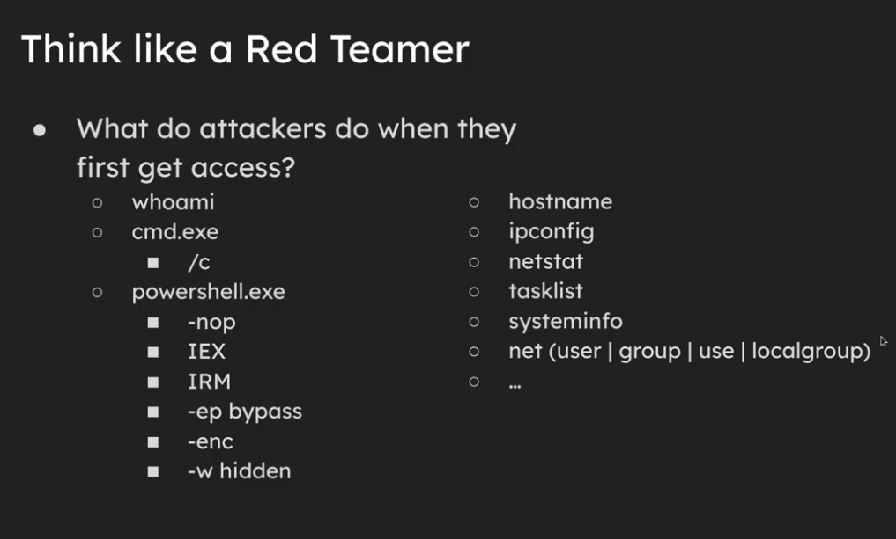

# Windows Blue Team

## Record events and take them off server for viewing and notification of suspicious activity
* Use sysmon
* Get a SIEM (Splunk or Wazuh)
* LDAP Object Monitor (See user changes live)
* EDR specialized software
    
## Detect Common First Access Programs
* whoami, etc
* Many of these programs should not have to be run at all


## Sysinternals Suite Provided by Windows
* Use sysmon
* AutoRuns - Finds anything that auto starts and has some advanced auto features like uploading to VirusTotal

## Common windows CLI commands
### Command Prompt
```
query user # Display a list of users

```
### Powershell
```
Get-LocalUser # Get all local users
```
```
Get-ADUser -Filter * # Get all active directory users
```
    
## SMB
* Disable SMB null and anonymous authentication
    - This is something that allows somebody to login without username and password and is abused frequently
    - Possibly keep it enabled and automatically block IPs that connect via it
    
## SSH
* Routinely check what SSH public keys are being stored and accepted
* Routinely check SSH configuration
    
## Dictionary
* Endpoint: Any decive that connects to a network and can send, recieve, or process data.
* Sysmon: A windows service thats logs system activity to the Windows Event Log
* SIEM: Security Information and Event Management
* XDR: Extended Detection and Response
* Directory Server: Centralized databases that store and manage information about users, devices, and network resources.
    - Active Directory: Windows server version of a directory server
* EDR: Endpoint and Detection Response
    

## Recommended Tools
* Wazuh + https://github.com/socfortress/Wazuh-Rules/blob/main/Windows%20Powershell/100535-win_powershell_rules.xml
* LDAP Object Monitor: https://github.com/p0dalirius/LDAPmonitor
* BlueSpawn (EDR tailored software): https://github.com/ION28/BLUESPAWN
* AtomicRedTeam (Simulate attacks to test endpoint): https://www.atomicredteam.io/
